# Plasma TLS #     {#PlasmaTLS}

Transport Layer Security for plasma&trade;

# Client #   {#Client}

In the plasma&trade; client library, three URI schemes are now supported:</p>

1. `tcp://` means never use TLS (and fail if the server mandates use of TLS)
2. `tcps://` means always use TLS (and fail if the server doesn't support TLS)
3. `tcpo://` means use TLS if available, but fall back if not (aka "opportunistic encryption").

Note that `tcps` mandates authentication of the server certificate (since encryption without authentication is vulnerable to <a target="_blank" href="https://en.wikipedia.org/wiki/Man-in-the-middle_attack">man-in-the-middle attacks</a>), while `tcpo` also allows anonymous TLS, which does not require certificate set-up, but only protects against passive eavesdroppers (but that's okay, since by using `tcpo`, you're saying you don't require encryption at all, and an active attacker could always downgrade you to an unencrypted connection anyway).

The client will look for the file `certificate-authorities.pem` on the `ob_etc_path`. This file is required to do authentication of the server. (Therefore, it is required if the client specified `tcps://` or the server specifies `-S`, but otherwise it is optional.)

If `-C` is specified on the server, then the client also needs `client-certificate-chain.pem` and `client-private-key.pem`.

# Server #   {#Server}

```
-S only allow secure connections (using TLS)
-I only allow insecure connections (forbid TLS)
  (default is to allow both secure and insecure connections)
-C require client authentication (implies -S)
```

Thus, `-S` on the server is like `tcps://` on the client, `-I` on the server is like `tcp://` on the client, and the default on the server is like `tcpo://` on the client.

The server will look for the files `server-certificate-chain.pem`, `server-private-key.pem`, and `dh-params.pem` in the `ob_etc_path`, which defaults to:

On Linux:
```
~/.oblong/etc:/etc/oblong
```

On OS X:
```
~/Library/Application Support/oblong/etc:/etc/oblong
```

It can also be set with the `OB_ETC_PATH` environment variable.

`server-certificate-chain.pem` and `server-private-key.pem` are both required if authentication of the server is desired. (Therefore, it is required if the client specified `tcps://` or the server specifies `-S`, but otherwise it is optional.)

`dh-params.pem` is always optional. It is only needed if you want to supply your own <a target="_blank" href="https://openssl.org/docs/apps/dhparam.html">Diffie-Hellman parameters</a>. (And if you want to do that, you'll already know that you do.) If it is not found, built-in Diffie-Hellman parameters are used, which are fine for most purposes.

If `-C` is specified, then the server needs to find `certificate-authorities.pem` in order to validate the client's certificate.

# SPECIFYING CLIENT CERTIFICATES IN A NON-GLOBAL WAY #   {#Specifying-Client-Certificates}

Sometimes, you might not want to use the same client certificate on all of your pool hoses. In that case, specifying the client certificate via a file on the `ob_etc_path` is inconvenient. Therefore, there is a more advanced way of specifying client certificates in a more fine-grained way, if you need that functionality.

To do this, you need to create a `pool_context`. A `pool_context` is just an opaque data type which can contain additional information specified to various pool function calls. (In this case, the additional information will be our client certificate.) You can create a `pool_context` like this:

```
pool_context ctx = NULL;
OB_DIE_ON_ERROR (pool_new_context (&amp;ctx));
```

You'll need to have the certificate you want to use, in the form of a string, like this:

```
static const char my_certificate[] =
  "-----BEGIN CERTIFICATE-----\n"
  "MIIDlDCCAn6gAwIBAgIBAzALBgkqhkiG9w0BAQUwgakxCzAJBgNVBAYTAlVTMRMw\n"
  "EQYDVQQIEwpDYWxpZm9ybmlhMRQwEgYDVQQHEwtMb3MgQW5nZWxlczEaMBgGA1UE\n"
  "ChMRT2Jsb25nIEluZHVzdHJpZXMxKDAmBgNVBAsMH2RlcGFydG1lbnQgb2YgcGxh\n"
  "c21h4oSiIGhhY2tpbmcxKTAnBgNVBAMTIG15IGV4YW1wbGUgY2VydGlmaWNhdGUg\n"
  "YXV0aG9yaXR5MB4XDTEyMDgwMjA0Mzg1MVoXDTE3MDgwMjA0Mzg1MVowgY4xCzAJ\n"
  "BgNVBAYTAkVTMRIwEAYDVQQIEwlDYXRhbG9uaWExEjAQBgNVBAcTCUJhcmNlbG9u\n"
  "YTEaMBgGA1UEChMRT2Jsb25nIEluZHVzdHJpZXMxEjAQBgNVBAsMCXBsYXNtYeKE\n"
  "ojEnMCUGA1UEAxMeY2xpZW50IGNlcnRpZmljYXRlIGZvciB0ZXN0aW5nMIGcMAsG\n"
  "CSqGSIb3DQEBAQOBjAAwgYgCgYCjFKQjzr2BKgQKvLTU+aayQQHY6pQ8PPu04X1f\n"
  "7uBMxlsOUI/UpL59G+J0MkkNuOL7hCyIwVjnWb2XHeRYazg2/Q1sN6M6rz8q78u7\n"
  "zF3qPpo8xXTQzc05ZoM5GojTdE9R6L+kYQC67BgZS84jTuTTm80MIFa2Fpj45m8s\n"
  "FcXyrQIDAQABo2swaTAfBgNVHSMEGDAWgBRxTqECnBa+2QQNcEZWpekfoacyiTAM\n"
  "BgNVHRMBAf8EAjAAMA8GA1UdDwEB/wQFAwMHuAAwJwYDVR0lBCAwHgYIKwYBBQUH\n"
  "AwQGCCsGAQUFBwMCBggrBgEFBQcDATALBgkqhkiG9w0BAQUDggEBAAn5T/hRusm4\n"
  "IzaAltsojL6Io+gQ4jbJ+1tzrtOnvTneMIFQcQwQisD8ECGgdSj3sGZny01RUyxx\n"
  "iaeKuR4UbxUNqtmvSN/TlWNKWV23D7J/mfHdzRmlrD/onoDOZX3bWC3yd+zpzr9z\n"
  "8Gclj/PanSIAcg/h44fE3DcAtKXrLFk7EbSjs7ovb+g60Ok0JH7dKHiKi7JPbQBu\n"
  "UOMt3VxKUgYM68MjymeZs+kYYKjP+mT+3BDqzebjO44HRlEutitjgyc70E2oIHEL\n"
  "AYwjAOcUg3LrXECT2KaK2HSNLjGYTY3XX6UftwkLppGc8Ag32m2mkaQORRB/09v/\n"
  "zJSv1GA64CM=\n"
  "-----END CERTIFICATE-----\n";
```

And ditto for the private key. Then, create a slaw map with the certificate and private key, like this:

```
slaw options = slaw_map_inline_cc ("certificate", my_certificate,
                                   "private-key", my_private_key,
                                   NULL);
```

Now, you can use the map you just created to specify the options you want to context to contain:

```
OB_DIE_ON_ERROR (pool_ctx_set_options (ctx, options));
slaw_free (options);  // we're done with this guy now
```

In order to use a `pool_context`, you'll need to use the variants of the pool functions that end in `_ctx`. For example, to participate in a pool:

```
pool_hose ph = NULL;
OB_DIE_ON_ERROR (pool_participate_ctx ("salt-water-pool",  &amp;ph, ctx));
```

Beware that if you use a context when opening a hose, you have to wait until after you've withdrawn the hose before you can free the context:

```
OB_DIE_ON_ERROR (pool_withdraw (ph));
pool_free_context (ctx);
```

# CERTIFICATES #   {#Certificates}

In order to create the `certificate-authorities.pem`, `server-certificate-chain.pem`, `server-private-key.pem`, `client-certificate-chain.pem`, and `client-private-key.pem` files, you will need to create and use your own <a target="_blank" href="https://en.wikipedia.org/wiki/Certificate_authority">certificate authority</a>. If you are a large company, then your IT department will probably want to perform this function (or perhaps already does).

However, if you need to set up your own certificate authority to issue your own certificates, there are many ways to do this. OpenSSL can be used as a certificate authority from the command line, or there are various GUI or web-based tools you can set up to make the process easier. If you are already familiar with such a tool, it's probably easiest to use the tool you already know.

See the script ob-plasma-certs.sh for one example of how to do this using openssl; 'ob-plasma-certs.sh demo' generates all those files and demonstrates starting and using a pool server with them. This may be the easiest way to get started during development.

# CERTIFICATE GENERATION USING GNOMINT #   {#Certificate-Generation-gnoMint}

Openssl is a little hard to configure. Here's a walkthrough using a more approachable alternative, <a target="_blank" href="http://gnomint.sourceforge.net/">gnoMint</a>, an open-source GUI certificate authority.

To install on Ubuntu, do `sudo apt-get install gnomint`. To run, do `gnomint&amp;` or start it from the ubuntu launcher.

Sadly, like all GTK+ applications, gnoMint prints a lot of scary-sounding assertion failures when run from a terminal window...

```
(gnomint:1113): Gtk-WARNING **: GtkTable does not have a property called update_policy
(gnomint:1113): Gtk-CRITICAL **: gtk_radio_button_set_group: assertion `!g_slist_find (group, radio_button)' failed
(gnomint:1113): Gtk-CRITICAL **: gtk_window_get_size: assertion `GTK_IS_WINDOW (window)' failed
```

...which can be ignored.

The first thing you need to do is create a certificate authority. So, choose "Add > Add self-signed CA" from the "Certificates" menu:


Next, fill out the details for the new Certificate Authority. From plasma&trade;'s point of view, these values don't matter:

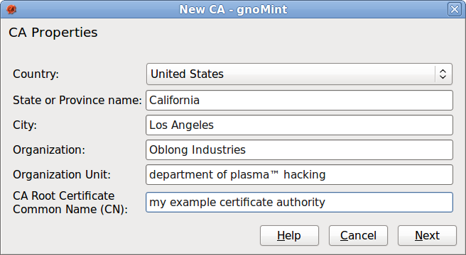

On the next screen are some details that do matter. We recommend using RSA certificates. (DSA should also work in theory, but we have not tested it.) Your private key should be at least 2048 bits for any real-world application. (Although you may choose a shorter key for testing purposes.) A key even longer than 2048 is advisable; see the <a target="_blank" href="http://www.keylength.com/en/3/">ECRYPT II recommendations</a>, in the "Asymmetric" column.

Choose the number of months you would like the certificate authority to last. Certificate authorities should have a fairly long life, longer than the life of any certificates that will be issued with it, since all certificates will need to be re-issued when the certificate authority expires. However, also keep in mind factors like at what point in the future the private key length you chose will no longer provide effective protection. (See the ECRYPT II table.)

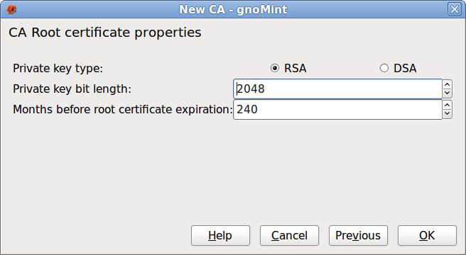

Creating the new CA will take some time:

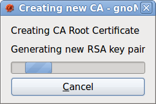

Now the gnoMint main screen will show your new Certificate Authority:

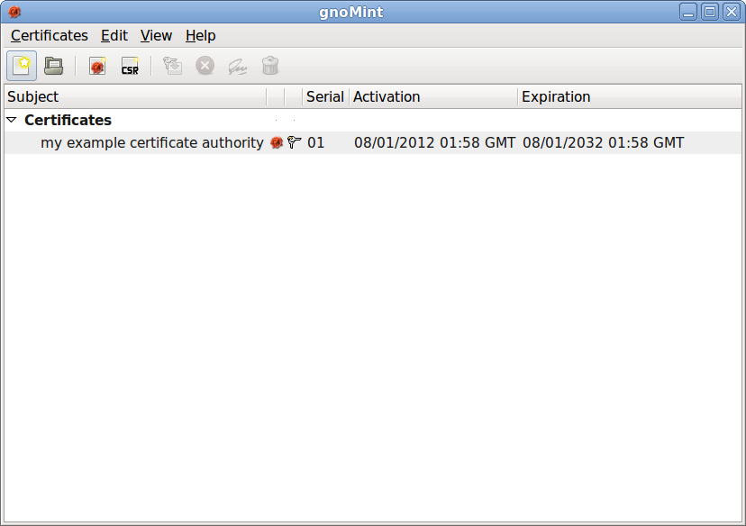

We are done creating the Certificate Authority. Now it is time to create a certificate (either a client certificate or a server certificate) which is signed by our CA. Choose "Add > Add Certificate Request" from the "Certificates" menu:

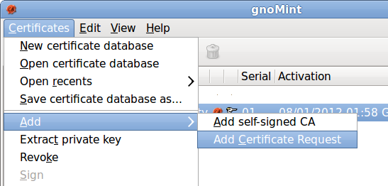

In the next screen, you need to choose your Certificate Authority (or which one if you have created more than one). The "inherit" choice doesn't seem to make any difference, at least with the Certificate Authority we created with gnoMint.


Once again, you need to fill out the details about your organization. If you are creating a certificate for server use, the "Certificate Common Name (CN)" must contain the <a target="_blank" href="https://en.wikipedia.org/wiki/Fully_qualified_domain_name">fully-qualified domain name</a> of the pool server where you intend to install the certificate. For client certificates, the Common Name field does not matter, although that may change in future versions of plasma&trade;.

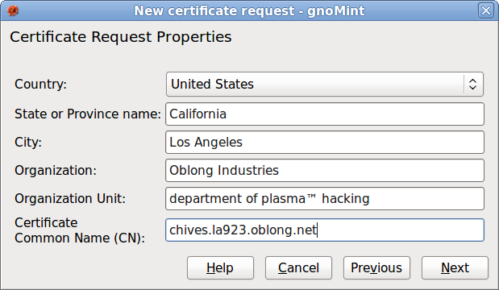

And, once again, you need to choose the type and bit length for the new certificate. We recommend RSA, and a key length of 2048 bits or more. Once again, refer to the ECRYPT II chart, and take into account how long you want the certificate to last.

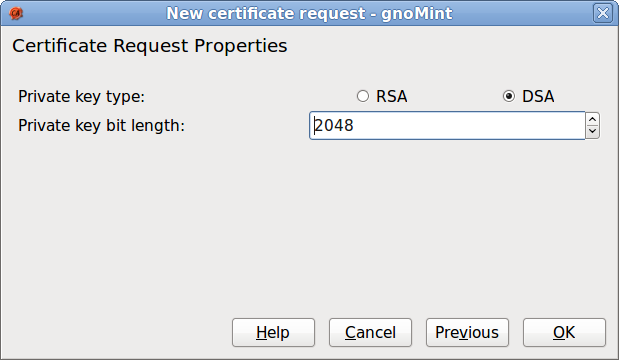

Once you have created the Certificate Signing Request (CSR), it will show up on the gnoMint main screen:

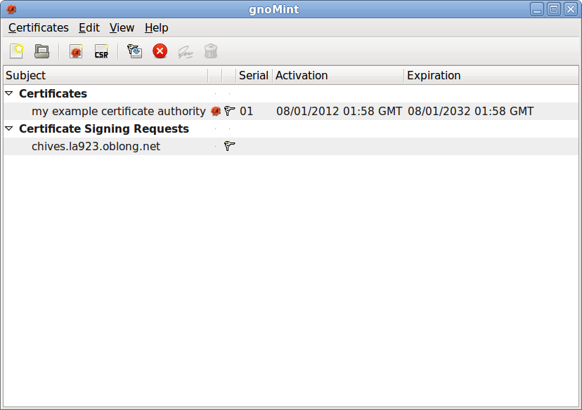

Right-click on your CSR and choose "Sign".

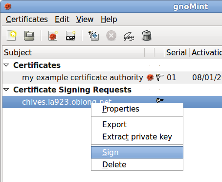

On the following screen, just click "Next".

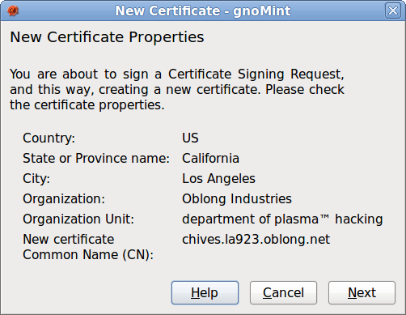

Choose the Certificate Authority. If you only have one, this is an easy choice.

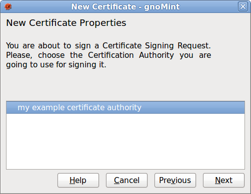

Choose the number of months for the certificate to last. The defaults for "Certificate uses" and "Certificate purposes" should be fine.

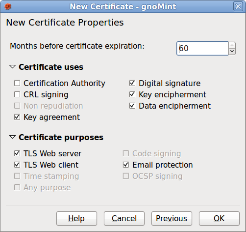

Now your certificate is signed, and will be shown on the gnoMint main screen underneath your Certificate Authority.

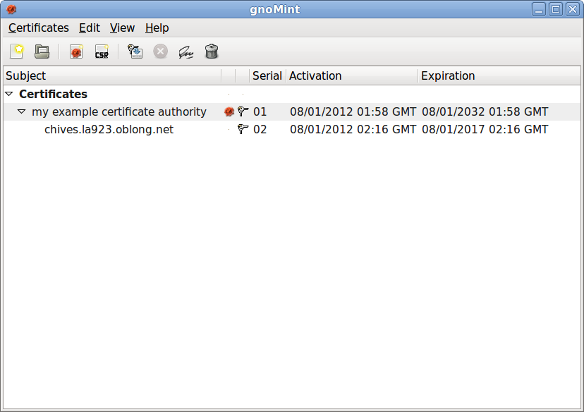

So, great, now you have your certificates. Next, you need to export them from gnoMint so you can use them in plasma&trade;. First, export your Certificate Authority by right-clicking on your Certificate Authority and choosing "Export".

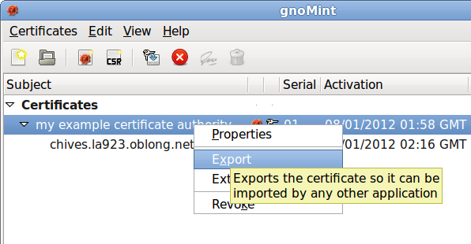

Choose "Only the public part." (You never need to export the CA's private key. That can stay safely in gnoMint.)

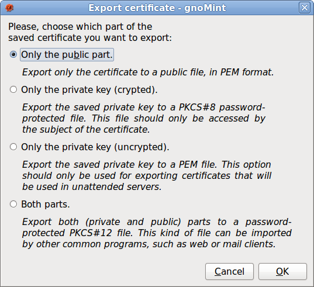

Choose a file to save the CA's public key in. (Note that gnoMint's window title is incorrect. We are exporting a CA public key, even though it says "Export certificate signing request.")

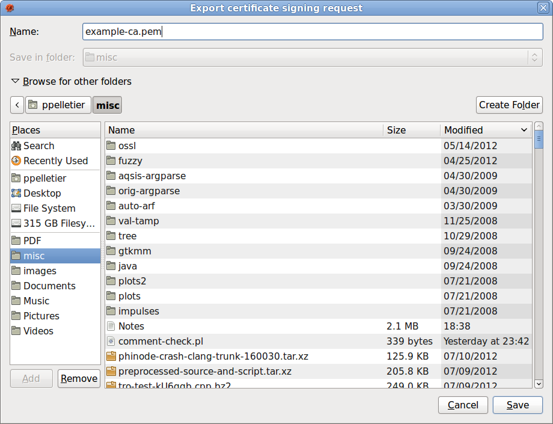

Once you have saved the CA's public key in a file, you should copy this file to a file named `certificate-authorities.pem`, in a directory on your `ob_etc_path`, such as `/etc/oblong`. (This is assuming you only have one CA.) If you have more than one CA, you need to append the public key you just exported to the existing `certificate-authorities.pem` file. You can have as many CAs in `certificate-authorities.pem` as you want.

The next step is to export the server (or client) certificate you created. Right-click on the certificate and choose "Export."

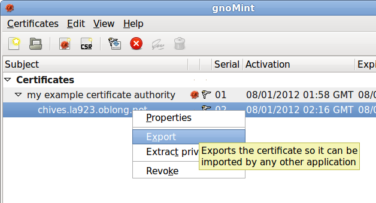

We need to export both the public key and private key, but we will do them separately. So first, choose "Only the public part."


Once again, choose a file name for the exported key. Once again, the window title is incorrect.

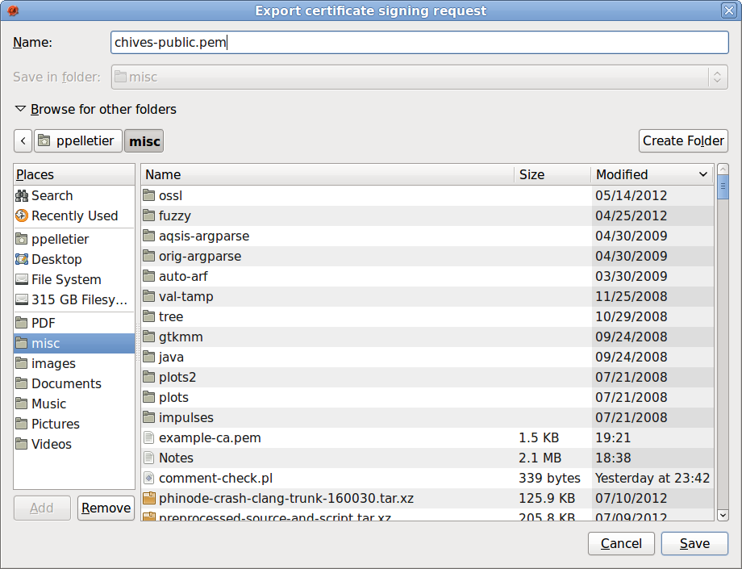

Right click on the server (or client) certificate again, and choose "Export" again. This time, choose "Only the private key (uncrypted)" instead.

You can also choose to export the private key encrypted with a password instead, if you prefer. This provides extra security, but it requires that you type the password each time the server (or client) is started, so it won't work for programs which are started automatically without user intervention. You can decide which is more appropriate for your situation.

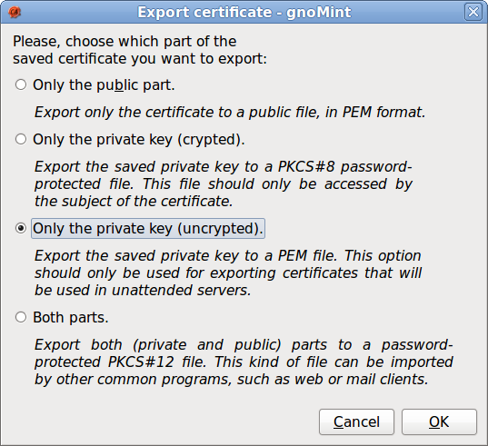

Once again, choose a file in which to save the private key.

You should copy the private key to a file named `server-private-key.pem`, again located somewhere on your `ob_etc_path`.

You should create a file named `server-certificate-chain.pem` somewhere on your `ob_etc_path`. Create this file by concatenating the server's public key, followed by the CA's public key.

(Longer certificate chains are possible, with intermediate Certificate Authorities, but that is a topic beyond the scope of this tutorial.)

If you are installing a client certificate instead of a server certificate, the same steps apply, but the files will be called `client-private-key.pem` and `client-certificate-chain.pem`.
